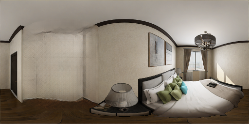

# PanoDR: Spherical Panorama Diminished Reality for Indoor Scenes

Diminishing the highlighted (red mask) object in indoor spherical panorama images. White lines annotate the
scene’s layout in panorama and perspective views. Left to right: i) masked object to remove, ii) pure inpainting result of
state-of-the-art methods (top row: RFR, bottom row: PICNet), iii) perspective view of inpainted region by these
methods better shows that they do not necessarily respect the scene’s structural layout, iv) our panorama inpainting that takes
a step towards preserving the structural reality, v) perspective view of inpainted region by our model, showing superior results
both in texture generation and layout preservation. The results in this figure depict cases where RFR and PICNet provide
reasonable structural coherency and aim at showcasing our model’s finer-grained accuracy.

# Abstract
The rising availability of commercial 360o cameras that democratize indoor scanning, has increased the interest for novel applications, such as interior space re-design. Diminished Reality (DR) fulfills the requirement of such applications, to remove existing objects in the scene, essentially translating this to a counterfactual inpainting task. While recent advances in data-driven inpainting have shown significant progress in generating realistic samples, they are not constrained to produce results with reality mapped
structures. To preserve the ‘reality’ in indoor (re-)planning applications, the scene’s structure preservation is crucial. To ensure structure-aware counterfactual inpainting, we propose a model that initially predicts the structure of a indoor scene and then uses it to guide the reconstruction of an empty – background only – representation of the same scene. We train and compare against other state-of-the-art methods on a version of the Structured3D dataset [47] modified for DR, showing superior results in both quantitative metrics and qualitative results, but more interestingly, our approach exhibits a much faster convergence rate.

#  PanoDR Model Architecture

The input masked image is encoded twice, once densely by the structure UNet encoder outputing a layout segmentation map,
and once by the surrounding context encoder, capturing the scene’s context while taking the mask into account via series
gated convolutions. These are then combined by the structure-aware decoder with a set of per layout component style
codes that are extracted by the complete input image. Two SEAN residual blocks ensure the structural alignment of the
reconstructed background image that is supervised by low- and high-level losses, as well as an adversarial loss driven by the
background image discriminator. The final diminished result is created via compositing the predicted and input images using
the diminishing mask.

# Qualitative results for diminishing objects from scenes in our test set. 

>From Left to right: Input image with the diminished area masked with transparent red, RFR, PICNet and ours.

# Acknowledgements
This project has received funding from the European Union's Horizon 2020 innovation programme ATLANTIS under grant agreement No 951900.
